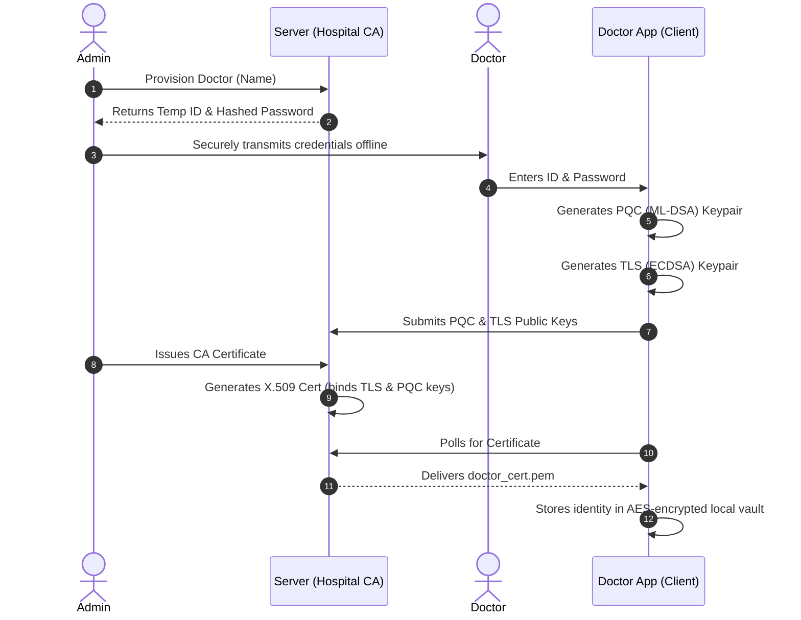

# VaultQ: Post-Quantum Secure Medical Record Vault

**VaultQ** is a next-generation, highly secure client–server medical record management system. Built from the ground up to withstand both modern cyber threats and future quantum computing attacks, VaultQ implements a hybrid cryptographic architecture that pairs classical algorithms (AES-GCM, ECDSA) with NIST-standardized Post-Quantum Cryptography (ML-DSA).

> **Goal:** Protect sensitive healthcare data today—and keep it secure in a post-quantum world.

---

## ⚠️ The Problem: Market Vulnerabilities in Healthcare

Current medical record systems suffer from critical security blind spots:

### 🔓 The Quantum Threat (“Store Now, Decrypt Later”)

Adversaries can harvest encrypted medical data today and decrypt it later when fault-tolerant quantum computers become available. Classical public-key cryptography (RSA, ECC) is vulnerable to Shor’s Algorithm, exposing decades of sensitive patient data.

### 🌐 Weak Transport Security

Many systems rely on standard TLS without strict mutual authentication, leaving them vulnerable to Man-in-the-Middle (MITM) attacks or unauthorized API access via stolen bearer tokens.

### 🧱 Implicit Trust & Weak Data-at-Rest Protection

Healthcare APIs often trust payloads from authenticated users without verifying payload integrity. Data is frequently encrypted at rest using a single database key—meaning one breach can compromise all patient records.

---

## 🛡️ The Solution: VaultQ Architecture

VaultQ mitigates these risks with a multi-layered cryptographic defense model:

### 🔐 Mutual TLS (mTLS)

Replaces weak password-based API tokens with strict cryptographic identity verification. Both server and doctor clients must present valid X.509 certificates before any application data is exchanged.

### ✍️ Post-Quantum Digital Signatures (ML-DSA-65)

Every medical record is signed by the doctor using a quantum-resistant private key. The server verifies record origin and integrity using the enrolled PQC public key.

### 📦 Application-Layer Envelope Encryption

Data is protected beyond transport encryption:

* Each record is encrypted with a one-time **Data Encryption Key (DEK)**
* The DEK is securely wrapped using the server’s vault key
* The server decrypts and re-encrypts using the **Server Master Key** before persisting to disk

---

## 🔄 System Workflows

### 1️⃣ Doctor Provisioning & PQC Enrollment

Before accessing VaultQ, a doctor must be provisioned and enrolled with both classical and post-quantum credentials.

---

### 2️⃣ Authentication & Secure Network Transport

VaultQ relies on industry-standard **Mutual TLS (mTLS)**:

* Uvicorn (OpenSSL-backed) enforces client certificate authentication
* Connections are terminated at the network layer if the client certificate is invalid or not signed by `hospital_root_ca.pem`

---

### 3️⃣ Secure Record Upload (Double Envelope Encryption)

Each uploaded medical record undergoes strict application-layer protection:

* Per-record one-time DEK
* Server-side key wrapping
* Re-encryption with the Server Master Key before persistence

This design ensures compromise of transport security does not expose stored patient data.

---

## 🗄️ Data Storage Architecture

VaultQ enforces strong segmentation and integrity checks at rest:

### 🔑 Server Master Key (`master_key.json`)

* Generated on first boot
* AES-256 key used to encrypt all data at rest
* Stored securely on the server

### 📘 Hospital Vault Database (`hospital_vault.json`)

Lightweight JSON store tracking:

* Provisioned doctors
* Bcrypt-hashed passwords
* Enrolled PQC public keys
* Issued X.509 certificate status

### 🗂️ Patient File Vaults (`storage/vault/<patient_id>/`)

* Dedicated directory per patient
* Records stored as encrypted JSON objects containing:

  * Ciphertext
  * Nonces
  * SHA-256 hashes
* A `record_hash` is computed over the full metadata context to detect tampering on disk

---

## 🛠️ Technology Stack

### Backend

* FastAPI / Uvicorn (Python)

### Desktop Client

* CustomTkinter (Python)

### Classical Cryptography

* `cryptography` (AES-GCM, ECDSA, X.509, AES Key Wrap)

### Post-Quantum Cryptography

* `dilithium-py` (ML-DSA-65)

### Password Hashing

* `passlib[bcrypt]`

### Admin Dashboard

* HTML5
* TailwindCSS
* Alpine.js

---

## ✅ Key Security Guarantees

* End-to-end cryptographic identity with mTLS
* Quantum-resistant integrity and non-repudiation
* Strong envelope encryption for data in transit and at rest
* Tamper detection for stored medical records
* Segmented storage to reduce breach blast radius

---

**VaultQ** is designed to protect patient privacy not just against today’s threats—but for the post-quantum future.

---
